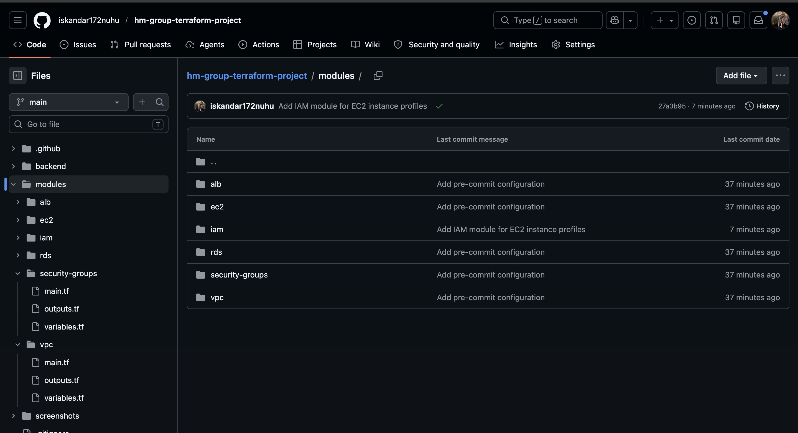
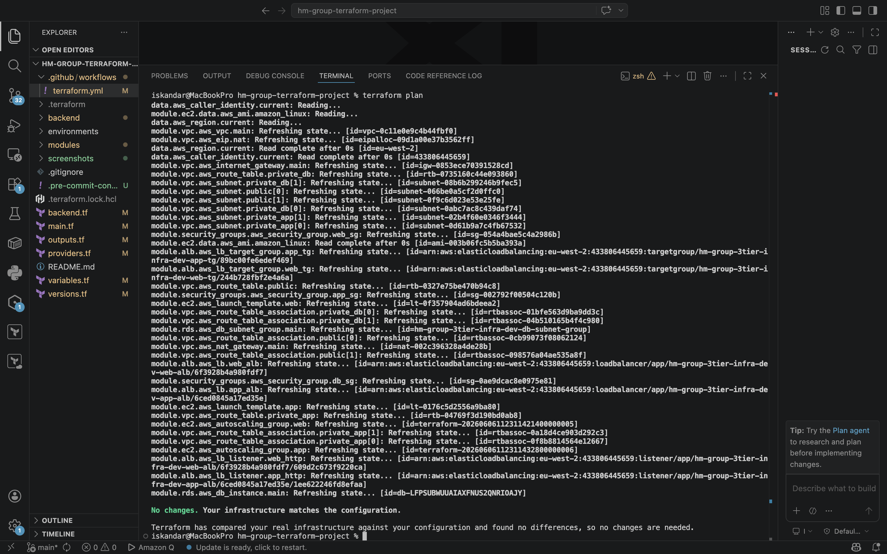
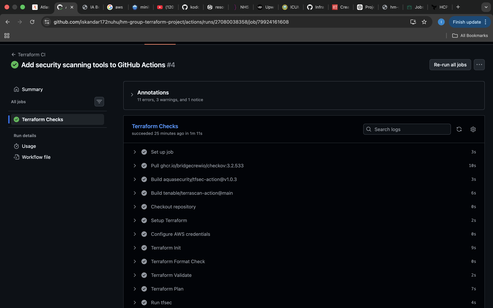
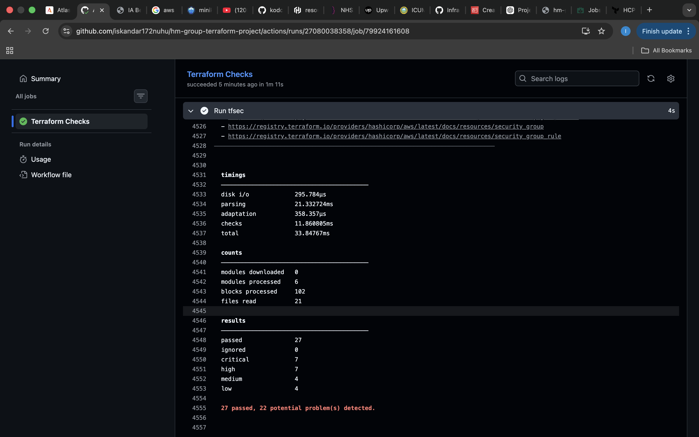
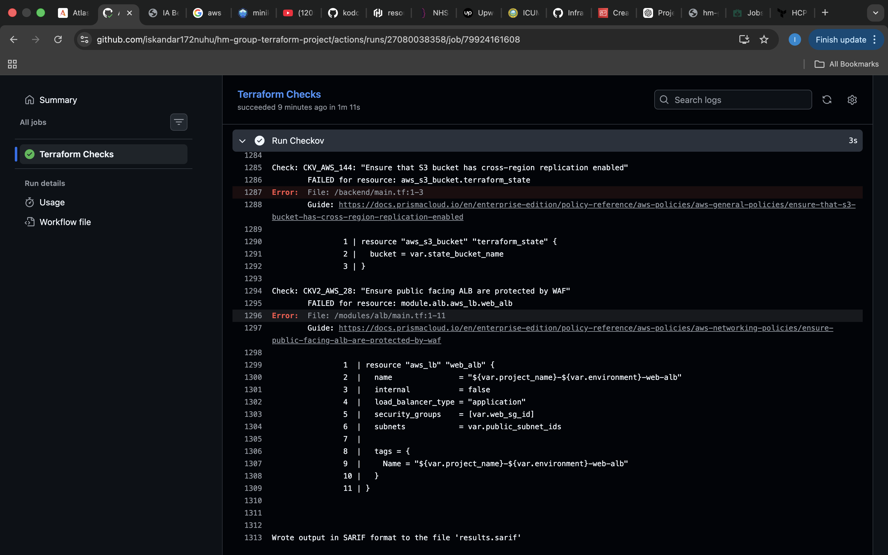
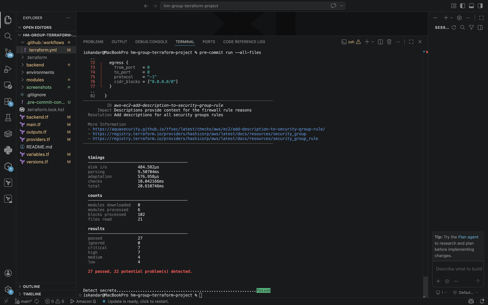
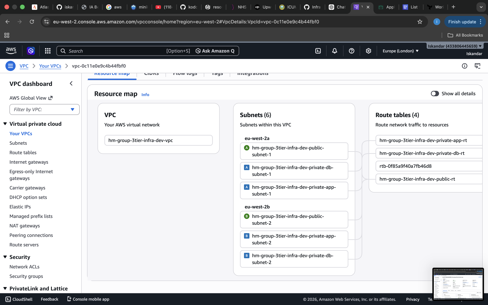
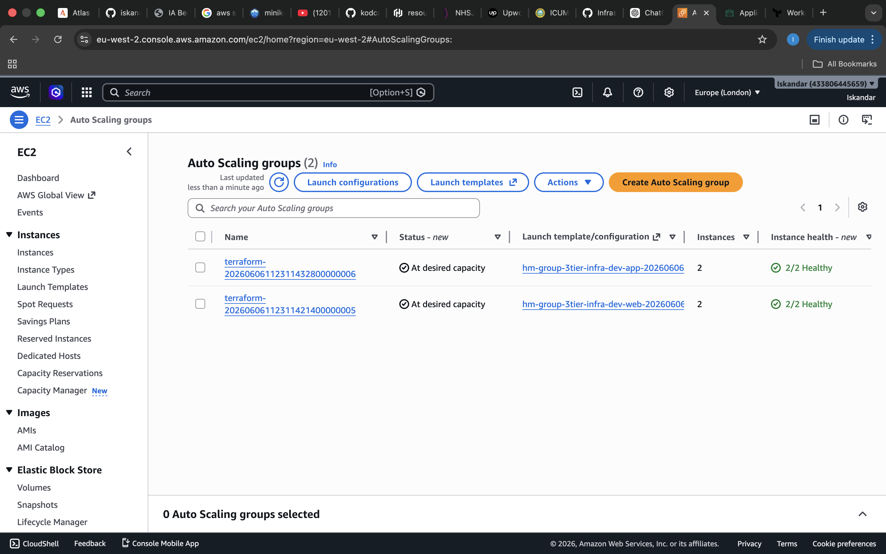
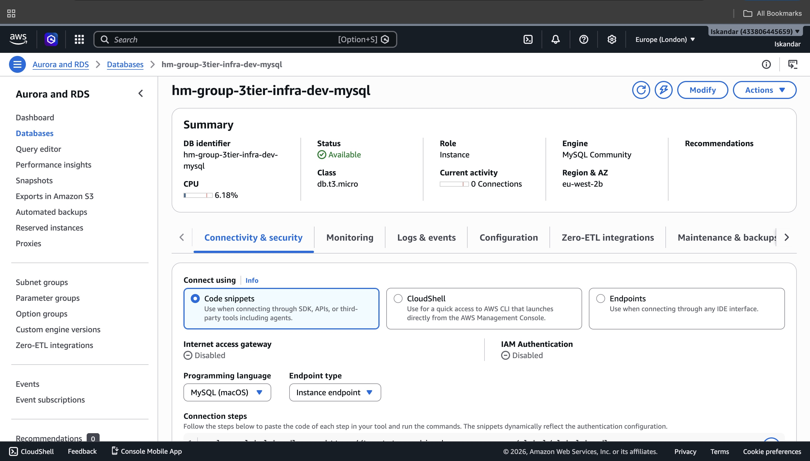
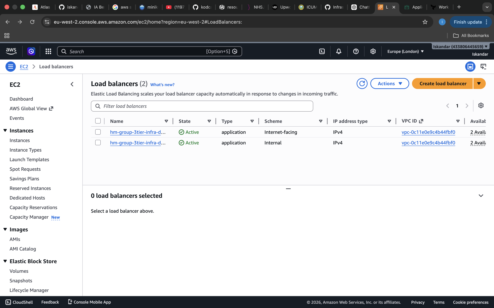

# HM Group — Production-grade AWS Infrastructure with Terraform

## Project Overview

HM Group required a secure, scalable, and highly available AWS infrastructure environment to support enterprise applications.

This project provisions a production-grade 3-tier AWS architecture using Terraform, automated through GitHub Actions and secured with integrated DevSecOps tooling and pre-commit hooks.

The infrastructure follows Infrastructure as Code (IaC) best practices and includes:

* Multi-AZ high availability
* Public and private subnet segmentation
* Auto Scaling EC2 infrastructure
* Application Load Balancers
* Amazon RDS Multi-AZ
* CI/CD automation
* Security scanning and compliance checks
* Remote Terraform state management

---

## Architecture

The solution follows a classic 3-tier architecture:

* Web Tier (Public Subnets)
* Application Tier (Private Subnets)
* Database Tier (Private DB Subnets)

Infrastructure is distributed across two Availability Zones for high availability and fault tolerance.

## Architecture Diagram

```mermaid
flowchart TD
    User[Internet Users] --> PublicALB[Public Application Load Balancer]

    PublicALB --> WebASG[Web Tier Auto Scaling Group]
    WebASG --> InternalALB[Internal Application Load Balancer]

    InternalALB --> AppASG[Application Tier Auto Scaling Group]
    AppASG --> RDS[(Amazon RDS MySQL Multi-AZ)]

    subgraph VPC[HM Group AWS VPC]
        subgraph PublicSubnets[Public Subnets]
            PublicALB
            WebASG
            NAT[NAT Gateway]
        end

        subgraph PrivateAppSubnets[Private Application Subnets]
            InternalALB
            AppASG
        end

        subgraph PrivateDBSubnets[Private Database Subnets]
            RDS
        end
    end

    GitHub[GitHub Actions CI/CD] --> Terraform[Terraform]
    Terraform --> VPC

---

## Technology Stack

* AWS
* Terraform
* GitHub Actions
* tfsec
* Checkov
* Trivy
* Terrascan
* Gitleaks
* Detect-Secrets
* Pre-commit Hooks

---

## Project Goals

* Build reusable Terraform modules
* Automate infrastructure deployments
* Enforce infrastructure security checks
* Implement enterprise DevOps practices
* Demonstrate production-grade AWS architecture

## 📸 Project Screenshots

### 1. GitHub Repository Structure



---

### 2. Terraform Plan Output



---

### 3. GitHub Actions CI/CD Pipeline



---

### 4. tfsec Security Scan Results



---

### 5. Checkov Security Scan Results



---

### 6. Pre-commit Hooks Execution



---

### 7. AWS VPC Deployment



---

### 8. EC2 Auto Scaling Groups



---

### 9. Multi-AZ RDS Deployment



---

### 10. Application Load Balancers


